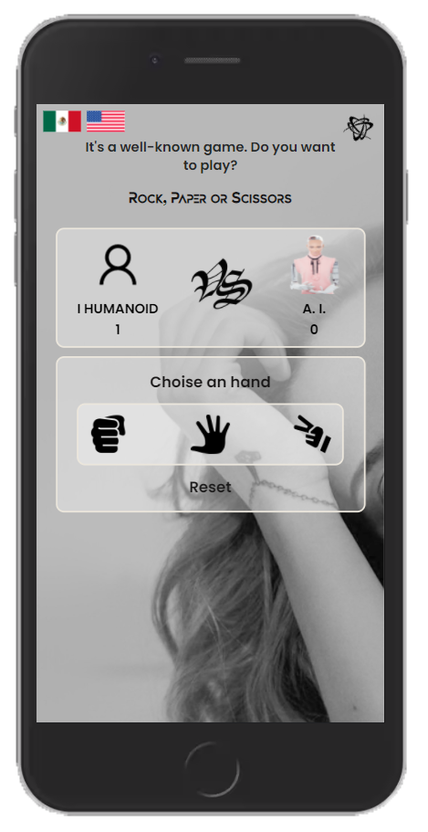
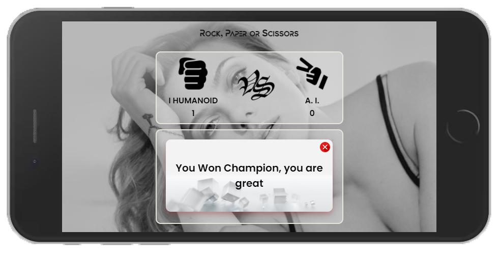

# Game Rock, Paper ó Tijera
 Una previa visualizacion del juego shown in this gif, for cell phones, tablets and desktop.

  

Cuando se trata de juego solo existen dos tipos, los ganadores y los perdedores donde tu juegas con la I. A. solo  encuentra la forma de vencerlo, los ganadores no dan escusas cuando el otro lado a jugado bien.

El reto del fuego, no solo fue css html y javascript, sino entender el algoritmo detras del juego. 
Jugar a "Piedra, papel o tijera" no solo es entrenamiento, tambien juega un papel importante la estrategia.
### Go to the Game.
right [here](https://brunomaldonado.github.io/App/)

------------

> Creator: Bruno Maldonado Rigoberto.

