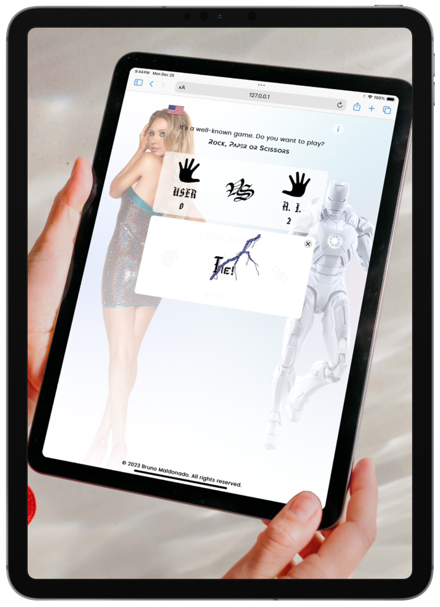

# Rock-Paper-Scissors game

A preview of the game, for mobile phone, tablets and desktop

<!-- 

  

 -->

  
  &nbsp; &nbsp; &nbsp; &nbsp;
  

<!-- <table>
  <tr style="border: none; background: transparent;">
    <td style="border: none;" valign="top"></td>
    <td style="border: none;" valign="top"></td>
  </tr>
</table> -->

When it comes to gambling there are only two types, winners and losers. Where you play with artificial intellingence. Figure out a way to beat him anyway. Winners don't make excuses when the other side plays the game.

  

The challenge of this exercise was not only the user interface, but to understand the algorithm behind the game, playing Rock Paper Scissors is not only training, but also plays an important role, the strategy.

### Go to the Game.

right <a href="https://brunomaldonado.github.io/App/" target="_blank">here</a>

> Creator: Bruno Maldonado Rigoberto.
